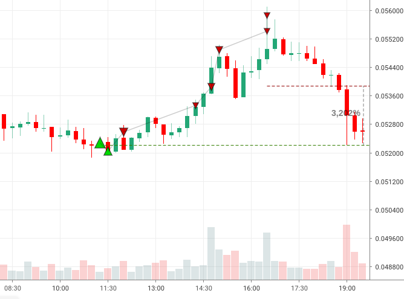
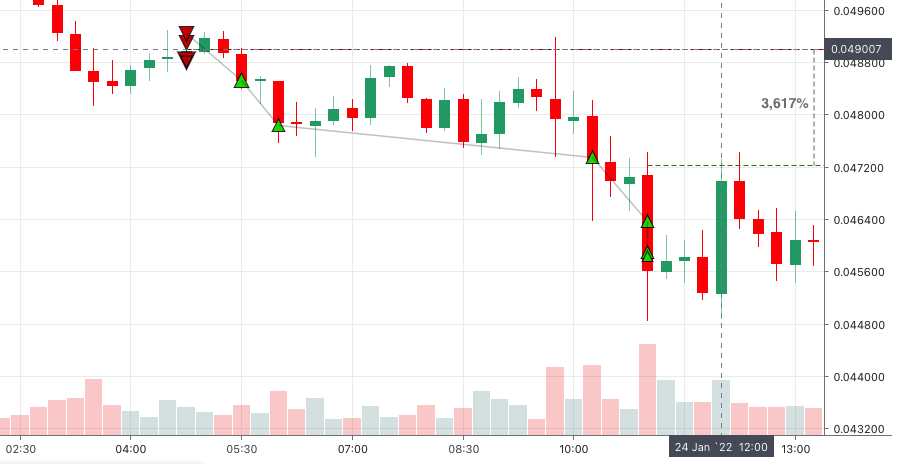

Welcome to candlestick_symphony - Futures trade bot
=================================

This is Python bot for the `Binance Futures`. I am in no way affiliated with Binance, use at your own risk.

For use this you need:
  - Python 3.8.10 
  - Ubuntu 20.04 
  - pip 20.0.2 
  - or other specifications
  - Recommended: Stable VPS 5$/month `Inferno Solutions <https://cp.inferno.name/aff.php?aff=3406>`_ 
  
  
Start step by step:
   - `Login Binance account <https://www.binance.com/?ref=MNJSQTZI>`_ 
   - Go to USDⓈ-M Page
   - Choice your symbol
   - `Turn ON Hedge mode <https://www.binance.com/en/support/faq/360041819691>`_
   - Generate API for Futures
   - Recommended: For easy trading analysis `Trading journal - Trader Make Money <https://tradermake.money/?ref=KGMY8G>`_
   

.. code:: bash

    :~$ lsb_release -a
    Description:  Ubuntu 20.04.3 LTS
    Release:  20.04
    
    :~$ python3 -V
    Python 3.8.10
    
    :~$ sudo apt install python3-pip
    :~$ pip3 -V
    pip 20.0.2 from /usr/lib/python3/dist-packages/pip (python 3.8)
    
    :~$ pip3 install python-binance
    :~$ pip3 install datetime
    
    :~$ apt install git
    :~$ git clone https://github.com/it-viktor/candlestick_symphony.git
    
    change candlestick_symphony.py:
    api_key = "****************"
    api_secret = "****************"
    symbol_trade = 'CELR'
    doji_difference = float(0.0001)  # the difference in points between the open and close of the candle
    
    :~$ python3 candlestick_symphony.py 
    Balance: 50 USDT
    
    System  time: 2022-01-24 19:43 Start the bot in search of the doji star...
 
 
 bot working! GOOD LUCK!!

.. code:: python

    # How it works...
    # After start candlestick_symphony.py
    # Check for signal doji star  # search_doji()
    if Signal == SUCCESS:
    
    # CALCULATION_POSITION  # calculate_summ_order_in():
    balance = 50  # USDT
    balance = balance * leverage_trade / symbol_trade_price
    market_position_summ = balance / 2  # for LONG or SHORT
    market_position_summ -= market_position_summ / 10 # for SL buffer
    market_position_summ = market_position_summ / 2  # for 1 market order
    limit_average_position_summ = market_position_summ / 2  # for 2 limit order
    
    # PLACE_ORDER
    For LONG Place 1 market BUY, 2 limit BUY, 4 limit SELL and 4 limit SELL if limit BUY success  # place_doji_long()
    For SHORT Place 1 market SELL, 2 limit SELL, 4 limit BUY and 4 limit BUY if limit SELL success  # place_doji_short()
    Place SL and TP
    Bot open 1 LONG or open 1 SHORT or open 1 LONG and 1 SHORT position

- Attention!!! There may be errors
- CAUTOIN!!! There may be STOPLOSS and LOSS OF YOUR MONEY!!!
- This version is only for USDT timeframe = 15m, leverage = 10 and symbol whose price is floating point(0.***)

       

